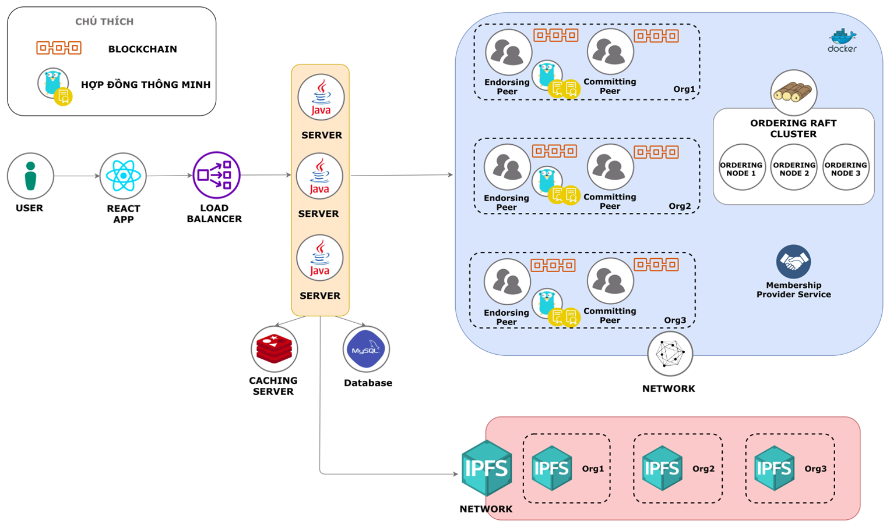

# Fabfund
Building enterprise capital management system with Blockchain technology (Hyperledger Fabric)

Author: Ta Dang Hieu Nghia (Ta)
Email: nghiatdh98@gmail.com

Content
- [x] Introduction
- [x] Idea
- [x] Solution
- [ ] Technology
  - [ ] Hyperledger Fabric
  - [ ] IPFS
- [ ] Source code

# Introduction

Fabfund là một project thực hiện khóa luận tốt nghiệp thuộc chuyên ngành Kỹ Thuật Phần Mềm - Trường Đại học Khoa học Tự nhiên. Đây là một hệ thống ứng dụng các tính chất của nền tảng công nghệ Blockchain để giải quyết vấn đề lưu trữ dữ liệu của doanh nghiệp sao cho vừa đảm bảo tính riêng tư, bảo mật nhưng lại vừa đảm bảo tính minh bạch, bất biến. Từ đó tạo niềm tin cho các bên thứ ba ngoài doanh nghiệp như nhà đầu tư, đối tác, ...

# Idea

Tính minh bạch thông tin, dữ liệu của một doanh nghiệp là điều mà nhiều doanh nghiệp Việt Nam hiện nay vẫn còn thiếu và đó cũng là một trong những hạn chế trong mắt các nhà đầu tư, đối tác nước ngoài. Hệ thống Fabfund sẽ cung cấp các tính năng và các đặc tính sau:
  - Quản lý dữ liệu doanh nghiệp (khóa luận chỉ dừng ở mức quản lý thu chi và lưu trữ báo cáo tài chính)
  - Dữ liệu minh bạch, bất biến
  - Dữ liệu được giám sát bởi nhiều bên liên quan

# Solution

Để xây dựng một hệ thống Fabfund cần phải hiện thực các mục tiêu sau:
- Thiết kế network dựa trên nền tảng công nghệ Blockchain cụ thể là Private Blockchain Network
- Thiết kế và triển khai Smart Contract
- Thiết kế và xây dựng hệ thống quản lý dữ liệu

## Private Blockchain Network

## Smart Contract (Chaincode)

## System Architecture

# Highlight Tech

## Hyperledger Fabric
To-do

## IPFS
To-do

# Source code

Với tính chất ứng dụng demo và thời gian không cho phép nên trong source vẫn còn kha khá "smell code" cũng như một số "cheat choét" nên mọi người thông cảm và thật tuyệt vời nếu bạn có thể tạo pull request và bổ sung những thiếu sót của mình. Thanks :D

